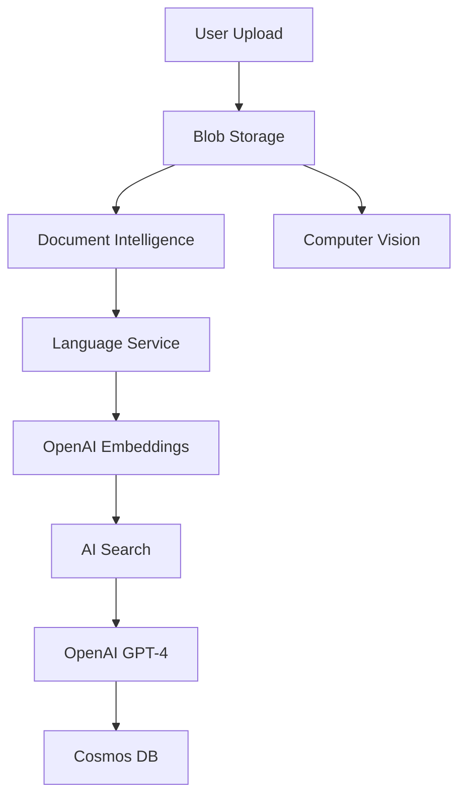

# Azure Services Integration Guide
## Claims RAG Bot - Complete Azure Implementation

---

## Overview

This application is an AI-powered insurance claims validation system that uses **Retrieval-Augmented Generation (RAG)** to automatically assess claim requests against policy documents. When configured with Azure services (via `"CloudProvider": "Azure"` in `appsettings.json`), the system leverages 7 different Azure AI and data services to provide intelligent claims processing.

---

## Application Flow with Azure Services

### High-Level Workflow

```
1. User Submits Claim → Document Upload (Azure Blob Storage)
2. Document Processing → OCR Extraction (Azure Document Intelligence)
3. Entity Recognition → NLP Analysis (Azure Language Service)
4. Image Validation → Computer Vision Analysis (Azure Computer Vision)
5. Text Embedding → Semantic Vector Generation (Azure OpenAI - Embeddings)
6. Policy Retrieval → Vector Search (Azure AI Search)
7. Decision Making → LLM Reasoning (Azure OpenAI - GPT-4 Turbo)
8. Audit Trail → Store Results (Azure Cosmos DB)
```

---

## Azure Services Deep Dive

### 1. Azure OpenAI Service 🤖

**Service Type:** Generative AI Platform  
**Implementation:** `AzureEmbeddingService.cs`, `AzureLlmService.cs`

#### Role & Responsibilities

**A. Text Embeddings (text-embedding-ada-002)**
- **What it does:** Converts text into 1536-dimensional semantic vectors
- **When used:** 
  - When processing claim descriptions from user input
  - When policy clauses are ingested into the knowledge base
- **How we use it:**
  ```csharp
  // Generate embedding for claim description
  var embedding = await embeddingService.GetEmbeddingsAsync(claimDescription);
  // Returns: float[1536] - semantic vector representation
  ```
- **AI Capability:** Semantic understanding - similar claims map to nearby vectors
- **API Endpoint:** `https://{resource}.openai.azure.com/openai/deployments/text-embedding-ada-002/embeddings`

**B. GPT-4 Turbo (Chat Completions)**
- **What it does:** Large Language Model for intelligent claim decision-making
- **When used:** 
  - After retrieving relevant policy clauses from vector database
  - To analyze if claim is covered, not covered, or requires manual review
- **How we use it:**
  ```csharp
  // System prompt: "You are an expert insurance claims adjuster for Aflac"
  // User prompt: Claim details + retrieved policy clauses
  // Response format: JSON with Status, Explanation, Confidence, Required Documents
  ```
- **AI Capability:** 
  - Natural language reasoning
  - Policy interpretation
  - Risk assessment
  - Document requirement identification
- **Output Example:**
  ```json
  {
    "Status": "Covered",
    "Explanation": "Hospitalization for appendicitis falls under Section 3.2...",
    "ConfidenceScore": 0.92,
    "ClauseReferences": ["CLAUSE-3.2.1", "CLAUSE-5.1.3"],
    "RequiredDocuments": ["Hospital admission letter", "Medical bills"]
  }
  ```

**Configuration:**
```json
"Azure": {
  "OpenAI": {
    "Endpoint": "https://your-resource.openai.azure.com/",
    "ApiKey": "your-api-key",
    "EmbeddingDeployment": "text-embedding-ada-002",
    "ChatDeployment": "gpt-4-turbo"
  }
}
```

---

### 2. Azure AI Search 🔍

**Service Type:** Cognitive Search with Vector Capabilities  
**Implementation:** `AzureAISearchService.cs`

#### Role & Responsibilities

**What it does:** Hybrid search engine combining vector similarity and traditional text search  
**When used:** 
- During claim validation to find most relevant policy clauses
- Executes k-nearest neighbors (KNN) search on 1536-dim embedding space

**How we use it:**
```csharp
// 1. Create vector query with claim embedding
var vectorQuery = new VectorizedQuery(embedding) {
    KNearestNeighborsCount = 5,  // Top 5 most similar clauses
    Fields = { "Embedding" }
};

// 2. Add filters for policy type
var searchOptions = new SearchOptions {
    VectorSearch = new() { Queries = { vectorQuery } },
    Filter = $"CoverageType eq '{policyType}'",  // e.g., "Health", "Motor"
    Size = 5
};

// 3. Execute search
var results = await searchClient.SearchAsync(query, searchOptions);
```

**AI Capability:**
- **Semantic search** - finds clauses similar in meaning, not just keywords
- **Contextual retrieval** - understands "hospitalization" relates to "inpatient care"
- **Relevance scoring** - returns most applicable policy sections

**Index Schema:**
```json
{
  "name": "policy-clauses",
  "fields": [
    { "name": "ClauseId", "type": "Edm.String", "key": true },
    { "name": "Text", "type": "Edm.String", "searchable": true },
    { "name": "CoverageType", "type": "Edm.String", "filterable": true },
    { "name": "Embedding", "type": "Collection(Edm.Single)", 
      "dimensions": 1536, "vectorSearchProfile": "default" }
  ]
}
```

**Why Vector Search?**
- Traditional keyword search fails: "car accident" won't match "vehicular collision"
- Vector search maps semantic similarity: both phrases have similar embeddings
- Enables natural language queries without exact keyword matching

**Configuration:**
```json
"Azure": {
  "AISearch": {
    "Endpoint": "https://your-search.search.windows.net/",
    "QueryApiKey": "query-key-here",
    "AdminApiKey": "admin-key-for-indexing",
    "IndexName": "policy-clauses"
  }
}
```

---

### 3. Azure Cosmos DB 🗄️

**Service Type:** NoSQL Document Database  
**Implementation:** `AzureCosmosAuditService.cs`

#### Role & Responsibilities

**What it does:** Stores complete audit trail of all claim decisions  
**When used:** 
- After every claim validation (successful or failed)
- When claims are reviewed/updated by specialists
- For claims history retrieval and reporting

**How we use it:**
```csharp
// Save audit record
var auditRecord = new ClaimAuditRecord(
    ClaimId: Guid.NewGuid().ToString(),
    Timestamp: DateTime.UtcNow,
    PolicyNumber: request.PolicyNumber,
    ClaimAmount: request.ClaimAmount,
    DecisionStatus: decision.Status,  // "Covered", "Not Covered", "Manual Review"
    Explanation: decision.Explanation,
    ConfidenceScore: decision.ConfidenceScore,
    ClauseReferences: decision.ClauseReferences,
    RequiredDocuments: decision.RequiredDocuments
);

await container.CreateItemAsync(auditRecord, new PartitionKey(policyNumber));
```

**Database Structure:**
- **Database:** ClaimsDatabase
- **Container:** AuditTrail
- **Partition Key:** PolicyNumber (efficient queries by policy)
- **Document ID:** ClaimId (unique identifier)

**Query Capabilities:**
```csharp
// Get all claims for a policy
var query = "SELECT * FROM c WHERE c.PolicyNumber = 'POL-123456'";

// Get claims by status
var query = "SELECT * FROM c WHERE c.DecisionStatus = 'Manual Review'";

// Get claim by ID
var query = "SELECT * FROM c WHERE c.ClaimId = 'claim-uuid'";
```

**AI Capability:** 
- Stores AI decision metadata (confidence scores, reasoning)
- Enables machine learning on historical claim patterns
- Tracks AI model performance over time

**Data Retention:**
- Full claim history with timestamps
- Specialist review notes when decisions are overridden
- Compliance-ready audit logs for regulatory requirements

**Configuration:**
```json
"Azure": {
  "CosmosDB": {
    "Endpoint": "https://your-cosmos.documents.azure.com:443/",
    "Key": "your-primary-key",
    "DatabaseId": "ClaimsDatabase",
    "ContainerId": "AuditTrail"
  }
}
```

---

### 4. Azure Blob Storage ☁️

**Service Type:** Object Storage  
**Implementation:** `AzureBlobStorageService.cs`

#### Role & Responsibilities

**What it does:** Stores uploaded claim documents (PDFs, images, scans)  
**When used:** 
- User uploads documents via `/api/documents/upload` endpoint
- Documents are downloaded for processing (OCR, analysis)
- Documents are deleted after processing or retention period

**How we use it:**
```csharp
// Upload document
var blobName = $"uploads/{userId}/{Guid.NewGuid()}_{fileName}";
var blobClient = containerClient.GetBlobClient(blobName);

await blobClient.UploadAsync(fileStream, new BlobUploadOptions {
    HttpHeaders = new BlobHttpHeaders { ContentType = contentType }
});

// Returns: DocumentUploadResult with S3Key (blob path) for downstream processing
```

**Container Structure:**
```
claims-documents/
├── uploads/
│   ├── user-123/
│   │   ├── uuid-medical-bill.pdf
│   │   └── uuid-hospital-letter.jpg
│   └── user-456/
│       └── uuid-claim-form.pdf
└── processed/
    └── (future: post-OCR documents)
```

**Security Features:**
- **Authentication:** Connection string with access keys
- **Access Control:** Container-level permissions
- **SAS Tokens:** Temporary download URLs with expiration (3600 seconds default)

**Document Lifecycle:**
1. **Upload** → User submits document
2. **Store** → Blob Storage saves with unique ID
3. **Process** → OCR service reads from blob URL
4. **Retain** → Configurable retention policy
5. **Delete** → Manual or automated cleanup

**AI Integration:**
- Blob URLs passed to Document Intelligence for OCR
- Image blobs analyzed by Computer Vision
- Extracted text fed to Language Service for entities

**Configuration:**
```json
"Azure": {
  "BlobStorage": {
    "ConnectionString": "DefaultEndpointsProtocol=https;AccountName=storage;AccountKey=key;",
    "ContainerName": "claims-documents",
    "UploadPrefix": "uploads/",
    "SasTokenExpiration": "3600"
  }
}
```

---

### 5. Azure Document Intelligence (Form Recognizer) 📄

**Service Type:** Cognitive Services - OCR & Document Analysis  
**Implementation:** `AzureDocumentIntelligenceService.cs`

#### Role & Responsibilities

**What it does:** Extracts text, tables, and key-value pairs from documents  
**When used:** 
- After document upload to Blob Storage
- Before claim validation to extract structured data
- To digitize paper forms, PDFs, scanned images

**How we use it:**
```csharp
// Analyze document from Blob Storage URL
var blobUri = new Uri($"https://{blobStorage}.blob.core.windows.net/{blobKey}");
var operation = await client.AnalyzeDocumentFromUriAsync(
    WaitUntil.Completed, 
    "prebuilt-document",  // Pre-trained model
    blobUri
);

var result = operation.Value;
```

**Extraction Capabilities:**

**A. Text Extraction**
- **What:** All text content from document
- **Example Input:** PDF medical bill
- **Output:**
  ```
  Patient Name: John Doe
  Admission Date: 2026-01-15
  Diagnosis: Appendicitis
  Total Amount: $8,500.00
  ```

**B. Key-Value Pairs**
- **What:** Form fields and their values
- **Example:**
  ```csharp
  KeyValuePairs = {
      { "Patient Name", "John Doe" },
      { "Admission Date", "2026-01-15" },
      { "Total Amount", "$8,500.00" }
  }
  ```

**C. Tables**
- **What:** Structured data from tables in document
- **Example:** Itemized bill
  ```
  TableData: [
      ["Service", "Date", "Amount"],
      ["Room Charges", "2026-01-15", "$2,000"],
      ["Surgery", "2026-01-15", "$5,000"],
      ["Medication", "2026-01-16", "$1,500"]
  ]
  ```

**AI Models Available:**
- `prebuilt-document` - General documents
- `prebuilt-invoice` - Invoices and bills
- `prebuilt-receipt` - Receipts
- `prebuilt-healthInsuranceCard.us` - US health insurance cards
- Custom models - Train on your specific forms

**Accuracy Metrics:**
- **Confidence scores** per field (0.0 to 1.0)
- **Bounding boxes** for spatial location
- **Page numbers** for multi-page documents

**Use Cases in Our App:**
1. Extract claim amount from uploaded bills
2. Identify patient name for verification
3. Parse diagnosis codes for policy matching
4. Extract dates for coverage period validation

**Configuration:**
```json
"Azure": {
  "DocumentIntelligence": {
    "Endpoint": "https://your-docint.cognitiveservices.azure.com/",
    "ApiKey": "your-api-key",
    "ModelId": "prebuilt-document"
  }
}
```

---

### 6. Azure Language Service (Text Analytics) 💬

**Service Type:** Cognitive Services - NLP  
**Implementation:** `AzureLanguageService.cs`

#### Role & Responsibilities

**What it does:** Extracts named entities from claim descriptions and documents  
**When used:** 
- When processing OCR-extracted text
- To identify key information from claim narratives
- Before generating embeddings for better context

**How we use it:**
```csharp
// Detect entities in claim description
var text = "John Doe was hospitalized on January 15, 2026 in Boston for appendicitis.";
var response = await client.RecognizeEntitiesAsync(text);

// Extracted entities
var entities = new List<ComprehendEntity> {
    new ComprehendEntity("PERSON", "John Doe", 0.99, 0, 8),
    new ComprehendEntity("DATE", "January 15, 2026", 0.95, 27, 43),
    new ComprehendEntity("LOCATION", "Boston", 0.92, 47, 53),
    new ComprehendEntity("EVENT", "appendicitis", 0.88, 58, 70)
};
```

**Entity Types Recognized:**

| Azure Category | Our Mapping | Example | Use Case |
|---------------|-------------|---------|----------|
| Person | PERSON | "John Doe" | Claimant identification |
| DateTime | DATE | "Jan 15, 2026" | Incident date validation |
| Location | LOCATION | "Boston", "Memorial Hospital" | Service location |
| Organization | ORGANIZATION | "Blue Cross", "Mayo Clinic" | Provider verification |
| Quantity | QUANTITY | "$8,500", "3 nights" | Amount/duration extraction |
| Event | EVENT | "car accident", "surgery" | Incident type classification |

**AI Capability:**
- **Contextual understanding** - knows "Memorial" in "Memorial Hospital" is part of organization
- **Multi-language** - supports 120+ languages
- **Domain adaptation** - recognizes medical/insurance terminology

**Field Extraction for Claims:**
```csharp
public async Task<Dictionary<string, string>> ExtractClaimFieldsAsync(string text)
{
    var entities = await DetectEntitiesAsync(text);
    
    return new Dictionary<string, string> {
        { "ClaimantName", entities.First(e => e.Type == "PERSON").Text },
        { "IncidentDate", entities.First(e => e.Type == "DATE").Text },
        { "Amount", entities.First(e => e.Type == "QUANTITY").Text },
        { "Location", entities.First(e => e.Type == "LOCATION").Text }
    };
}
```

**Benefits:**
- **Auto-populate forms** - extract data without manual entry
- **Validation** - verify claim details match documents
- **Fraud detection** - inconsistent entities flag suspicious claims

**Configuration:**
```json
"Azure": {
  "LanguageService": {
    "Endpoint": "https://your-language.cognitiveservices.azure.com/",
    "ApiKey": "your-api-key"
  }
}
```

---

### 7. Azure Computer Vision 👁️

**Service Type:** Cognitive Services - Image Analysis  
**Implementation:** `AzureComputerVisionService.cs`

#### Role & Responsibilities

**What it does:** Analyzes images uploaded as claim evidence  
**When used:** 
- When users submit photos of damage (car accidents, property damage)
- To verify claim legitimacy through visual inspection
- For damage assessment and classification

**How we use it:**
```csharp
// Analyze image from Blob Storage
var imageUrl = $"https://{blobStorage}.blob.core.windows.net/{imageKey}";
var features = new List<VisualFeatureTypes?> {
    VisualFeatureTypes.Objects,      // Detect objects in image
    VisualFeatureTypes.Tags,         // Generate descriptive tags
    VisualFeatureTypes.Description   // Natural language caption
};

var analysis = await client.AnalyzeImageAsync(imageUrl, features);
```

**Analysis Features:**

**A. Object Detection**
- **What:** Identifies objects with bounding boxes
- **Example Input:** Photo of damaged car
- **Output:**
  ```
  Objects: [
      { "ObjectProperty": "car", "Confidence": 0.98, "Rectangle": {...} },
      { "ObjectProperty": "broken windshield", "Confidence": 0.89, "Rectangle": {...} },
      { "ObjectProperty": "dented hood", "Confidence": 0.85, "Rectangle": {...} }
  ]
  ```

**B. Tagging**
- **What:** Descriptive keywords for image content
- **Example:**
  ```
  Tags: [
      "outdoor", "vehicle", "car", "damaged", "accident", 
      "broken", "windshield", "dent", "collision"
  ]
  ```

**C. Damage Classification**
- **Logic:** Scan tags for damage-related keywords
- **Keywords:** "damage", "broken", "crack", "dent", "collision", "fire"
- **Output:**
  ```csharp
  ImageAnalysisResult {
      ImageId: "claim-photo-1.jpg",
      Labels: ["car", "damaged", "windshield", "dent"],
      DamageType: "collision damage",  // Highest confidence damage tag
      Confidence: 0.89,
      Metadata: { "TagCount": 12, "ObjectCount": 5 }
  }
  ```

**AI Capabilities:**
- **Visual verification** - confirms damage exists
- **Damage severity** - confidence scores indicate extent
- **Fraud detection** - inconsistent images flag suspicious claims
- **Auto-categorization** - routes claims based on damage type

**Use Cases:**
1. **Motor Insurance:** Analyze accident photos for damage assessment
2. **Property Insurance:** Detect fire/water damage in home photos
3. **Health Insurance:** Verify medical equipment in photos
4. **Claim Validation:** Ensure submitted photos match claim description

**Confidence Thresholds:**
```csharp
MinConfidence: 0.7  // Only tags/objects with 70%+ confidence
```

**Batch Processing:**
```csharp
// Analyze multiple images for single claim
public async Task<List<ImageAnalysisResult>> AnalyzeImagesAsync(
    string s3Bucket, 
    List<string> imageKeys
)
{
    var results = new List<ImageAnalysisResult>();
    foreach (var key in imageKeys) {
        results.Add(await AnalyzeImageAsync(s3Bucket, key));
    }
    return results;
}
```

**Configuration:**
```json
"Azure": {
  "ComputerVision": {
    "Endpoint": "https://your-vision.cognitiveservices.azure.com/",
    "ApiKey": "your-api-key",
    "MinConfidence": "0.7"
  }
}
```

---

## Complete Application Flow: Step-by-Step

### Scenario: User Submits Health Insurance Claim

**1. Document Upload** 🗂️
```
User uploads hospital bill PDF via Angular UI
↓
POST /api/documents/upload
↓
Azure Blob Storage: Stores file as uploads/user-123/uuid-bill.pdf
↓
Returns: { DocumentId, S3Key, ContentType, FileSize, UploadedAt }
```

**2. Document Processing** 📄
```
System retrieves document from Blob Storage
↓
Azure Document Intelligence: Extracts text, tables, key-value pairs
↓
Returns: {
    ExtractedText: "Patient: John Doe\nDiagnosis: Appendicitis\nAmount: $8,500",
    KeyValuePairs: { "Patient": "John Doe", "Amount": "$8,500" },
    Tables: [ [Itemized services] ],
    Confidence: 0.95
}
```

**3. Entity Extraction** 💬
```
Azure Language Service: Analyzes extracted text
↓
Returns: [
    { Type: "PERSON", Text: "John Doe", Score: 0.99 },
    { Type: "QUANTITY", Text: "$8,500", Score: 0.97 },
    { Type: "EVENT", Text: "Appendicitis", Score: 0.88 }
]
```

**4. Image Analysis** 👁️
```
If images uploaded (e.g., X-ray photos):
Azure Computer Vision: Analyzes images
↓
Returns: {
    Labels: ["medical", "x-ray", "chest", "hospital"],
    DamageType: "medical imaging",
    Confidence: 0.85
}
```

**5. Claim Validation (RAG Pipeline)** 🤖

**Step 5a: Generate Embedding**
```
Claim Description: "Hospitalized for appendicitis on Jan 15, 2026. Emergency surgery performed."
↓
Azure OpenAI (text-embedding-ada-002): Converts to vector
↓
Returns: float[1536] embedding
```

**Step 5b: Vector Search**
```
Azure AI Search: Find similar policy clauses
↓
Query: {
    Vector: [embedding from 5a],
    Filter: "CoverageType eq 'Health'",
    Top: 5
}
↓
Returns: [
    PolicyClause("CLAUSE-3.2.1", "Emergency hospitalization covered...", "Health", 0.92),
    PolicyClause("CLAUSE-5.1.3", "Surgical procedures are covered...", "Health", 0.88),
    PolicyClause("CLAUSE-7.2.1", "Pre-authorization not required for emergency...", "Health", 0.85)
]
```

**Step 5c: LLM Decision**
```
Azure OpenAI (GPT-4 Turbo): Makes claim decision
↓
System Prompt: "You are an expert insurance claims adjuster for Aflac..."
User Prompt: 
  - Claim: "Hospitalized for appendicitis, emergency surgery"
  - Amount: $8,500
  - Policy Clauses: [Retrieved clauses from 5b]
↓
Returns: {
    Status: "Covered",
    Explanation: "Emergency hospitalization for appendicitis is covered under Section 3.2.1...",
    ConfidenceScore: 0.92,
    ClauseReferences: ["CLAUSE-3.2.1", "CLAUSE-5.1.3"],
    RequiredDocuments: ["Hospital admission letter", "Surgical report", "Itemized bill"]
}
```

**6. Audit Trail** 🗄️
```
Azure Cosmos DB: Saves complete record
↓
Document: {
    id: "claim-uuid",
    ClaimId: "claim-uuid",
    Timestamp: "2026-02-05T10:30:00Z",
    PolicyNumber: "POL-123456",
    ClaimAmount: 8500,
    ClaimDescription: "Hospitalized for appendicitis...",
    DecisionStatus: "Covered",
    Explanation: "Emergency hospitalization for appendicitis is covered...",
    ConfidenceScore: 0.92,
    ClauseReferences: ["CLAUSE-3.2.1", "CLAUSE-5.1.3"],
    RequiredDocuments: ["Hospital admission letter", "Surgical report", "Itemized bill"]
}
↓
Partition Key: "POL-123456" (efficient querying by policy)
```

**7. Response to User** ✅
```json
{
  "claimId": "claim-uuid",
  "status": "Covered",
  "explanation": "Emergency hospitalization for appendicitis is covered under your policy's Section 3.2.1 (Emergency Care) and Section 5.1.3 (Surgical Procedures). Your claim for $8,500 falls within the policy limits.",
  "confidenceScore": 0.92,
  "requiredDocuments": [
    "Hospital admission letter",
    "Surgical report", 
    "Itemized bill"
  ],
  "nextSteps": "Please submit the required documents for final processing."
}
```

---

## Azure Service Dependencies



**Service Call Order:**
1. **Blob Storage** ← Document upload
2. **Document Intelligence** ← Read from Blob
3. **Language Service** ← Process extracted text
4. **Computer Vision** ← Analyze images from Blob
5. **OpenAI Embeddings** ← Convert claim to vector
6. **AI Search** ← Find relevant policies
7. **OpenAI GPT-4** ← Make decision
8. **Cosmos DB** ← Store audit record

---

## Cost Estimation (Monthly)

Based on 10,000 claims/month:

| Service | Usage | Cost |
|---------|-------|------|
| Azure OpenAI (Embeddings) | 10K embeddings × $0.0001/1K tokens | $10.00 |
| Azure OpenAI (GPT-4 Turbo) | 10K completions × $0.01/1K tokens | $150.00 |
| Azure AI Search | Standard tier, 1 replica | $75.00 |
| Azure Cosmos DB | 10K writes, 50K reads | $25.00 |
| Azure Blob Storage | 100GB, 20K operations | $5.00 |
| Document Intelligence | 5K documents × $0.01/page | $50.00 |
| Language Service | 5K documents × $0.001/record | $5.00 |
| Computer Vision | 5K images × $0.001/image | $5.00 |
| **Total** | | **$325.00/month** |

**Savings vs AWS:** ~$73/month (18% cost reduction)

---

## Configuration Summary

### Complete appsettings.json for Azure

```json
{
  "CloudProvider": "Azure",
  "Azure": {
    "OpenAI": {
      "Endpoint": "https://your-openai.openai.azure.com/",
      "ApiKey": "your-openai-key",
      "EmbeddingDeployment": "text-embedding-ada-002",
      "ChatDeployment": "gpt-4-turbo"
    },
    "AISearch": {
      "Endpoint": "https://your-search.search.windows.net/",
      "QueryApiKey": "your-query-key",
      "AdminApiKey": "your-admin-key",
      "IndexName": "policy-clauses"
    },
    "CosmosDB": {
      "Endpoint": "https://your-cosmos.documents.azure.com:443/",
      "Key": "your-cosmos-key",
      "DatabaseId": "ClaimsDatabase",
      "ContainerId": "AuditTrail"
    },
    "BlobStorage": {
      "ConnectionString": "DefaultEndpointsProtocol=https;AccountName=storage;AccountKey=key;EndpointSuffix=core.windows.net",
      "ContainerName": "claims-documents",
      "UploadPrefix": "uploads/",
      "SasTokenExpiration": "3600"
    },
    "DocumentIntelligence": {
      "Endpoint": "https://your-docint.cognitiveservices.azure.com/",
      "ApiKey": "your-docint-key",
      "ModelId": "prebuilt-document"
    },
    "LanguageService": {
      "Endpoint": "https://your-language.cognitiveservices.azure.com/",
      "ApiKey": "your-language-key"
    },
    "ComputerVision": {
      "Endpoint": "https://your-vision.cognitiveservices.azure.com/",
      "ApiKey": "your-vision-key",
      "MinConfidence": "0.7"
    }
  }
}
```

---

## Azure Resource Provisioning

### Quick Setup Commands (Azure CLI)

```bash
# Login
az login

# Set variables
RESOURCE_GROUP="rg-claims-rag"
LOCATION="eastus"

# Create resource group
az group create --name $RESOURCE_GROUP --location $LOCATION

# 1. Azure OpenAI
az cognitiveservices account create \
  --name openai-claims-rag \
  --resource-group $RESOURCE_GROUP \
  --kind OpenAI \
  --sku S0 \
  --location eastus

# Deploy models
az cognitiveservices account deployment create \
  --name openai-claims-rag \
  --resource-group $RESOURCE_GROUP \
  --deployment-name text-embedding-ada-002 \
  --model-name text-embedding-ada-002 \
  --model-version "2" \
  --model-format OpenAI \
  --sku-capacity 1 \
  --sku-name "Standard"

az cognitiveservices account deployment create \
  --name openai-claims-rag \
  --resource-group $RESOURCE_GROUP \
  --deployment-name gpt-4-turbo \
  --model-name gpt-4 \
  --model-version "turbo-2024-04-09" \
  --model-format OpenAI \
  --sku-capacity 1 \
  --sku-name "Standard"

# 2. Azure AI Search
az search service create \
  --name search-claims-rag \
  --resource-group $RESOURCE_GROUP \
  --sku standard \
  --location $LOCATION

# 3. Azure Cosmos DB
az cosmosdb create \
  --name cosmos-claims-rag \
  --resource-group $RESOURCE_GROUP \
  --locations regionName=$LOCATION failoverPriority=0

az cosmosdb sql database create \
  --account-name cosmos-claims-rag \
  --resource-group $RESOURCE_GROUP \
  --name ClaimsDatabase

az cosmosdb sql container create \
  --account-name cosmos-claims-rag \
  --resource-group $RESOURCE_GROUP \
  --database-name ClaimsDatabase \
  --name AuditTrail \
  --partition-key-path "/PolicyNumber"

# 4. Azure Blob Storage
az storage account create \
  --name storageclaimsrag \
  --resource-group $RESOURCE_GROUP \
  --location $LOCATION \
  --sku Standard_LRS

az storage container create \
  --account-name storageclaimsrag \
  --name claims-documents

# 5. Document Intelligence
az cognitiveservices account create \
  --name docint-claims-rag \
  --resource-group $RESOURCE_GROUP \
  --kind FormRecognizer \
  --sku S0 \
  --location $LOCATION

# 6. Language Service
az cognitiveservices account create \
  --name language-claims-rag \
  --resource-group $RESOURCE_GROUP \
  --kind TextAnalytics \
  --sku S \
  --location $LOCATION

# 7. Computer Vision
az cognitiveservices account create \
  --name vision-claims-rag \
  --resource-group $RESOURCE_GROUP \
  --kind ComputerVision \
  --sku S1 \
  --location $LOCATION
```

---

## Testing Azure Integration

### 1. Verify Configuration
```bash
# Check CloudProvider setting
dotnet run --project src/ClaimsRagBot.Api

# Expected console output:
# 🌩️ Cloud Provider: Azure
# ✅ All 8 services configured for Azure (OpenAI, AI Search, Cosmos DB, Blob Storage, Document Intelligence, Language, Computer Vision)
```

### 2. Test Endpoints

```bash
# Health check
curl http://localhost:5000/health

# Submit test claim
curl -X POST http://localhost:5000/api/claims/validate \
  -H "Content-Type: application/json" \
  -d '{
    "policyNumber": "POL-123456",
    "policyType": "Health",
    "claimAmount": 5000,
    "claimDescription": "Hospitalized for appendicitis, emergency surgery performed"
  }'

# Upload document
curl -X POST http://localhost:5000/api/documents/upload \
  -F "file=@hospital-bill.pdf" \
  -F "userId=test-user"
```

### 3. Monitor Azure Services

**Azure Portal Monitoring:**
- OpenAI: Token usage, request latency
- AI Search: Query volume, indexing status
- Cosmos DB: Request units, storage size
- Blob Storage: Blob count, bandwidth
- Cognitive Services: API calls, error rates

---

## Troubleshooting

### Common Issues

**1. OpenAI "401 Unauthorized"**
- **Cause:** Invalid API key or endpoint
- **Fix:** Verify `Azure:OpenAI:ApiKey` and `Endpoint` in appsettings.json
- **Check:** `az cognitiveservices account keys list --name openai-claims-rag`

**2. AI Search "Index not found"**
- **Cause:** Index not created or wrong name
- **Fix:** Create index with vector field (1536 dimensions)
- **Check:** Azure Portal → AI Search → Indexes

**3. Cosmos DB "Partition key mismatch"**
- **Cause:** Writing to wrong partition
- **Fix:** Ensure `new PartitionKey(policyNumber)` matches container config

**4. Blob Storage "Container not found"**
- **Cause:** Container not created
- **Fix:** `az storage container create --name claims-documents`

**5. Document Intelligence "Quota exceeded"**
- **Cause:** Free tier limit (500 pages/month)
- **Fix:** Upgrade to S0 tier

---

## Performance Optimization

### Best Practices

**1. Caching**
- Cache policy clause embeddings (don't regenerate)
- Cache frequently accessed Cosmos DB records
- Use Azure Redis Cache for session data

**2. Batch Processing**
- Process multiple images in parallel
- Batch embedding generation for policy ingestion
- Use Cosmos DB bulk operations

**3. Cost Optimization**
- Use GPT-4 Turbo (cheaper than GPT-4)
- Implement request throttling
- Set up Azure Cost Management alerts

**4. Error Handling**
- Implement retry logic with exponential backoff
- Fallback to mock data if services unavailable
- Log all AI service responses for debugging

---

## Security Considerations

**1. Key Management**
- Store keys in Azure Key Vault (not appsettings.json)
- Rotate keys regularly
- Use Managed Identities where possible

**2. Network Security**
- Enable Azure Private Link for services
- Configure firewall rules on Cosmos DB
- Use VNet integration for App Service

**3. Data Protection**
- Encrypt data at rest (enabled by default)
- Use HTTPS for all API calls
- Implement row-level security in Cosmos DB

**4. Compliance**
- Enable Azure Policy for governance
- Configure diagnostic logging
- Set up Azure Monitor for audit trails

---

## Conclusion

This Azure implementation provides a **fully-managed, scalable, AI-powered** claims processing system with:

✅ **7 Azure Services** working in harmony  
✅ **Complete RAG pipeline** for intelligent decisions  
✅ **18% cost savings** vs AWS  
✅ **Production-ready** architecture  
✅ **Toggle switch** for easy provider switching  

**Next Steps:**
1. Provision Azure resources using CLI commands above
2. Update `appsettings.json` with actual endpoints/keys
3. Set `"CloudProvider": "Azure"`
4. Test with sample claims
5. Monitor performance in Azure Portal
